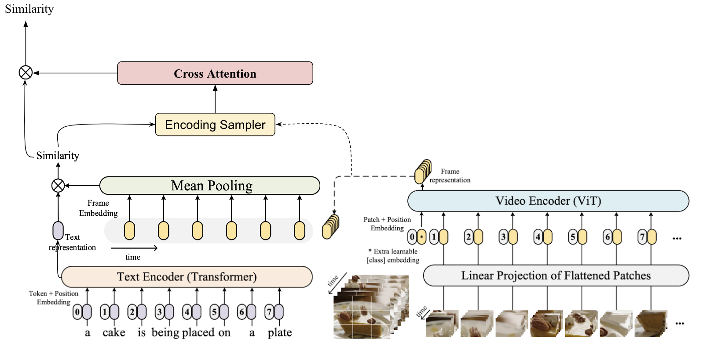

# New_CLIP4Clip

New_CLIP4Clip is a video-text retrieval model based on  [CLIP4Clip](https://github.com/ArrowLuo/CLIP4Clip). We investigate three similarity calculation approaches: parameter-free type, sequential type, and tight type, in this work. The model achieve SOTA results on MSR-VTT, MSVD, LSMDC, ActivityNet, and DiDeMo.



## Requirement
```sh
# From CLIP
conda install --yes -c pytorch pytorch=1.7.1 torchvision cudatoolkit=11.0
pip install ftfy regex tqdm
pip install opencv-python boto3 requests pandas
```

## Data Preparing

**For MSRVTT**

The official data and video links can be found in [link](http://ms-multimedia-challenge.com/2017/dataset). 

For the convenience, you can also download the splits and captions by,
```sh
wget https://github.com/ArrowLuo/CLIP4Clip/releases/download/v0.0/msrvtt_data.zip
```

Besides, the raw videos can be found in [sharing](https://github.com/m-bain/frozen-in-time#-finetuning-benchmarks-msr-vtt) from *Frozen️ in Time*, i.e.,
```sh
wget https://www.robots.ox.ac.uk/~maxbain/frozen-in-time/data/MSRVTT.zip
```


## Compress Video for Speed-up (optional)
```sh
python preprocess/compress_video.py --input_root [raw_video_path] --output_root [compressed_video_path]
```
This script will compress the video to *3fps* with width *224* (or height *224*). Modify the variables for your customization.

## How to Run 

>`--features_path` is the video root path
> 
>`--linear_patch` can be set with `2d` or `3d`
> 
> `--sim_header` can be set with `meanP`, `seqLSTM`, `seqTransf`, or `tightTransf`
> 
> `--pretrained_clip_name` can be set with `ViT-B/32` or `ViT-B/16`
> 
> `--resume_model` can be used to reload the saved optimizer state to continuely train the model, **Note**: need to set the corresponding chechpoint via `--init_model` simultaneously. 

read our paper for more details on `--linear_patch` and `--sim_header`. Test more hyperparameters for better performance. 

Download CLIP (ViT-B/32) weight,
```sh
wget -P ./modules https://openaipublic.azureedge.net/clip/models/40d365715913c9da98579312b702a82c18be219cc2a73407c4526f58eba950af/ViT-B-32.pt
```
or, download CLIP (ViT-B/16) weight,
```sh
wget -P ./modules https://openaipublic.azureedge.net/clip/models/5806e77cd80f8b59890b7e101eabd078d9fb84e6937f9e85e4ecb61988df416f/ViT-B-16.pt
```

Then, run


*The CLIP (ViT-B/32) is the default setting in the paper, replacing with the ViT-B/16 for better performance.*

### MSRVTT

```sh
DATA_PATH=[Your MSRVTT data and videos path]
python -m torch.distributed.launch --nproc_per_node=4 \
main_task_retrieval.py --do_train --num_thread_reader=0 \
--epochs=5 --batch_size=128 --n_display=50 \
--train_csv ${DATA_PATH}/MSRVTT_train.9k.csv \
--val_csv ${DATA_PATH}/MSRVTT_JSFUSION_test.csv \
--data_path ${DATA_PATH}/MSRVTT_data.json \
--features_path ${DATA_PATH}/MSRVTT_Videos \
--output_dir ckpts/ckpt_msrvtt_retrieval_looseType \
--lr 1e-4 --max_words 32 --max_frames 12 --batch_size_val 16 \
--datatype msrvtt --expand_msrvtt_sentences  \
--feature_framerate 1 --coef_lr 1e-3 \
--freeze_layer_num 0  --slice_framepos 2 \
--loose_type --linear_patch 2d --sim_header meanP \
--pretrained_clip_name ViT-B/32
```


# Acknowledgments
Our code is based on [CLIP4Clip](https://github.com/ArrowLuo/CLIP4Clip), [CLIP](https://github.com/openai/CLIP) and [UniVL](https://github.com/microsoft/UniVL).
